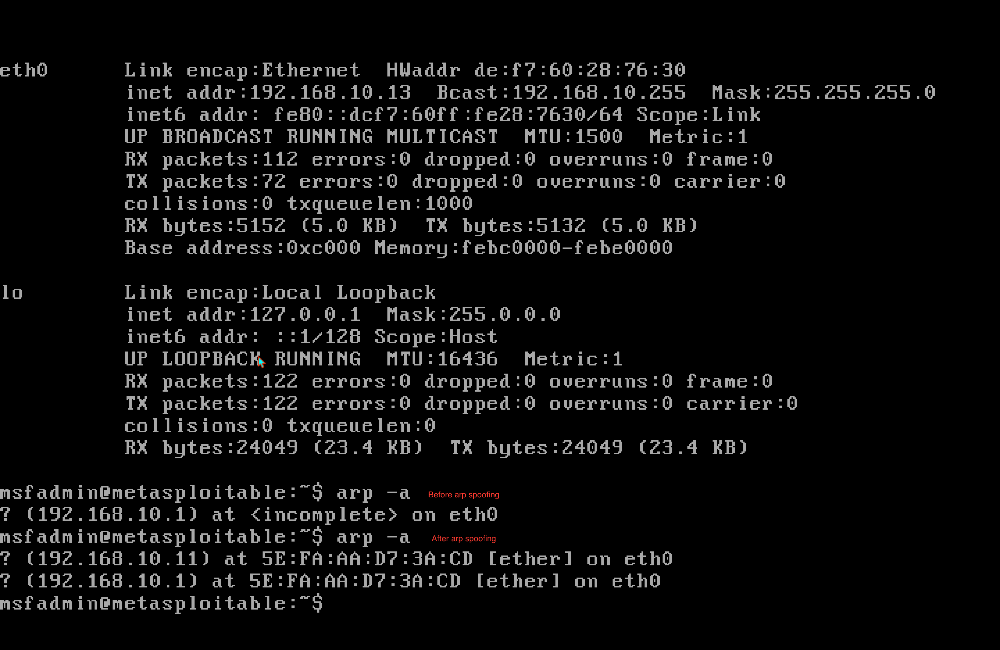
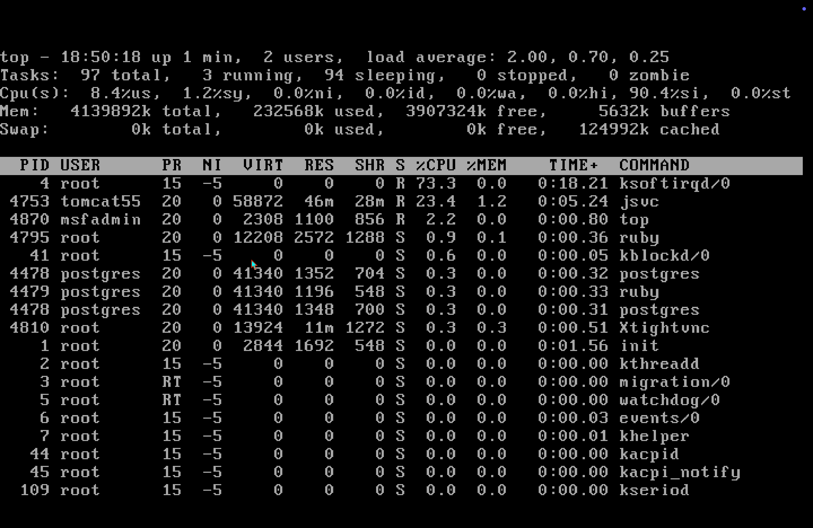
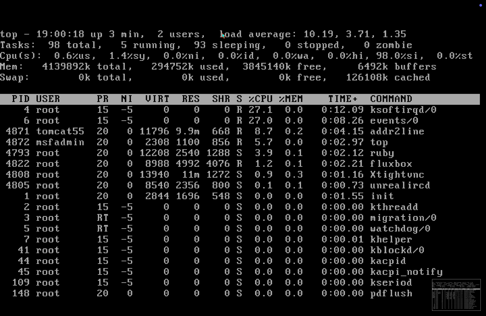
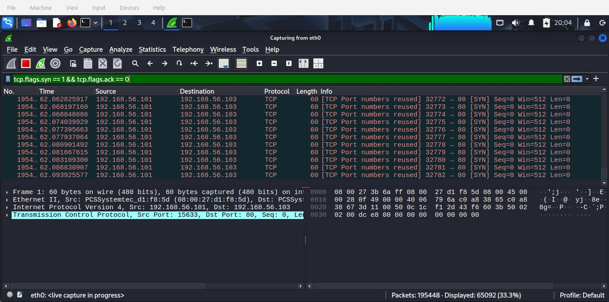
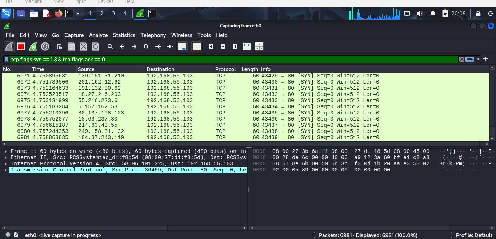
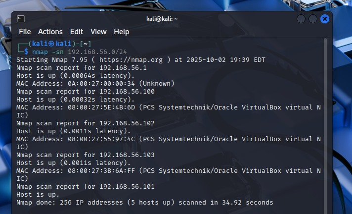
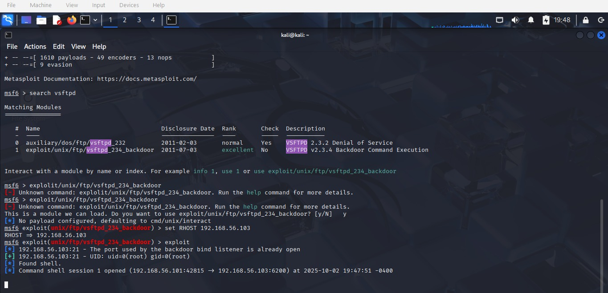
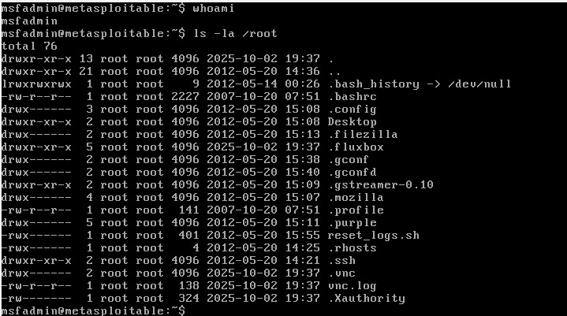
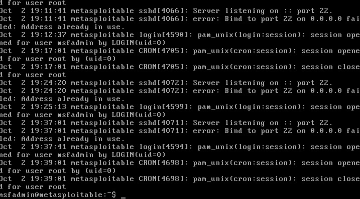
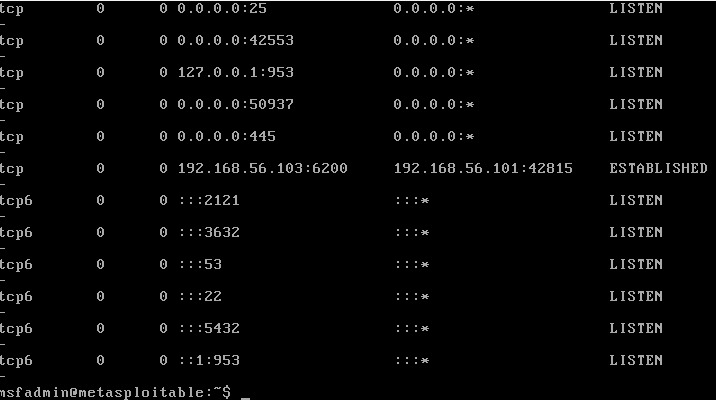

### **Assignment 2 Report**  
#### CSCI 5743: Cyber and Infrastructure Defense, Fall 2025  

**Name & Student ID**: [Deeksha Reddy Patlolla], [111444513]  

---

# **Section 1: Conceptual Assignments**  

### **1. ARP Poisoning & Advanced MITM Techniques**  

Overview & advanced bypasses: By tricking hosts into linking an attacker's MAC to a different IP address ( often the gateway), ARP poisoning    ( also known as ARP spoofing) makes it possible for MITM techniques such traffic interseption,manipulation,&session hijacking.The bar is raised by defenses like Dynamic ARP Inspection( DAI) & static ARP entries,although attackers have developed counters.For example, on poorly configured hosts, attackers can employ ARP reply flooding to overload ARP table capacity and impose fallback behaviors,or they can utilize gratuitous-ARP timing attacks to continuously rewrite caches until static entries are finally overwritten.Proxy ARP manipulation is another sophisticated tactic;in this case, an attacker responds to ARP queries for addresses they are not allocated and then, after verification or alteration, routes traffic to the actual host.This allows the attacker to selectively intercept traffic without completely contaminating the entire subnet & extends control beyond their local IP-MAC pair

Attacking switched, VLAN-segmented environments: Although it is more difficult,ARP poisoning is still possible on a fully switched network with VLAN segmentation.Attackers can take advantage of compromised hosts in various VLANs,misuse router on a stick configuraions where a susceptible intermediate relays interVLAN traffic, or attack misconfigured ports ( such as access ports put in the incorrect VLAN).  Additionally, attackers may employ VLAN hopping or double-tagging to access other VLANs & subsequently perform ARP-based MITM if VLAN pruning or trunking is configured wrong( for example, native VLAN mismatch ).It is also possible to replay or alter the ARP state by manipulating compromised infrastructure equipment,such as an exposed management interface or a switch that has been improperly configured

Mitigations: Combine port security,802.1X for per-port authentication,stringent VLAN assignment,&host-based safeguards( HIDS) that identify unusual ARP changes with static ARP & DAI.ARP monitoring & alerting, encrypted link-layer alternatives ( like MACsec for sensitive links), & network segmentation that reduces flat L2 domains all contribute to layered security,which makes it more dificult for attackers to succeed by chaining together more zero-day or misconfiguration vulnerabilities

### **2. ARP Spoofing in IPv6 Networks**  
NDP & IPv6 equivalent attacks:The Neighbor Discovery Protocol ( NDP),which employs ICMPv6 for address resolution,router discovery, & neighbor reachability,takes the place of ARP in IPv6.Neighbor Advertisement /Neighbor Solicitation ( NDP) spofing is the functional counterpart of ARP spoofing on IPv6.By sending fraudulent neighbor advertisements purporting to be the owner of an IPv6 address or the address of the default router, an attacker might trick victims into updating their neighbor cache & rerouting traffic, therefore executing a Man in the  Middle   (MITM ).Furthermore, hosts may be tricked by Router Advertisement ( RA) spoofing into accepting a rogue router or allocating incorrect network settings ( DNS, prefixes)

Difficulty & effectiveness comparison: When networks are unprotected, NDP spoofing is as simple as ARP poisoning since both rely on neighbor message trust & operate at layer 2 /3.Nevertheless, NDP encompasses more message kinds ( RAs, NS/NA, and Redirect ) & more built-in mechanisms (like Secure Neighbor Discovery & SEND ) that can harden interactions, providing attackers with new avenues ( such rogue prefix ads to poison host routing or RA floods to induce DoS ).Because IPv6 networks sometimes employ various addresing patterns ( SLAAC vs. DHCPv6) & some hosts deploy privacy extensions, NDP spoofing could be a little more difficult to carry out at scale.However,attacks are just as effective in loose networks

Defenses: Strong defenses include limiting RA acceptance on host stacks,utilising RA guard on switches,implementing NDP inspection on switches  (ND inspection: binding IPv6 addresses to ports /MACs similar to DAI ), enabling Secure Neighbor Discovery( SEND) where possible( it uses Cryptogaphically Generated Addresses & X.509 like certificates ), & enforcing 802.1X to limit who can send NDP messages.These measures greatly lower the danger of NDP spoofing when used in conjunction with endpoint firewalls and IPv6 aware intrusion detection

### **3. DHCP Starvation & Rogue DHCP for Long-Term Persistence**  
Why DHCP Starvation works: A local DoS against network availability, DHCP starvation overloads a DHCP server with a high number of lease requests ( sometimes using fake MAC addresses ),depleting the server's pool and preventing legitimate clients from obtaining addresses.  Saturating the lease table, which stops new devices from joining & may require manual remediation, makes DHCP servers efficient since they usualy have a limited lease table and a relative confidence in MAC-based requests.

Rogue DHCP for persistence and pivoting: Attackers frequently create a rogue DHCP server that reacts to client DHCPDISCOVERs more quickly after starving the legitimate server.In order to facilitate persistent MITM, DNS spoofing (which reroutes web traffic), or the staging of C2 (command-and-control) infrastructure, the rogue server may include malicious options such as gateway, DNS, or NTP pointing to attacker-controlled sites.Long lease durations, backdoors accessible through assigned DNS entries, and selectively providing the right network parameters to evade detection while covertly exfiltrating traffic or pushing proxy settings to route traffic through monitoring proxies are all options for long-term persitence.Unless it is fixed or the endpoint's network stack is hardened, DHCP-based persistence endures reboots since it takes place at the client networking layer

Defense Strategy: Combine DHCP Snooping ( to construct DHCP-binding tables on switches ),802.1X ( to prohibit unauthorized ports), and port-based ACLs so only trustworthy DHCP servers are available.  Untrusted ports cannot transmit DHCP offers thanks to DHCP snooping;on mixed IPv4/IPv6 networks, RA-guard or switch-based filtering might be useful.Unusual lease assignments and increases in DHCPDISCOVER rates should be detected via logging and monitoring ( SIEM).Lastly, the efficacy of rogue DHCP is restricted beyond the first network layer by host hardening, which includes host-based firewalls, endpoint DNSSEC validation,& static DHCP reservations for important equipment 

### **4. VLAN Hopping & Subverting Network Segmentation**  
Alternate bypass techniques beyond double tagging & switch spoofing: Although DTP /switch-spoofing & double-tagging are well-known, attackers can also take advantage of other setup errors:1. Native VLAN mismatches can allow an attacker on one side to inject traffic that crosses into another VLAN if trunk ports have inconsistent native VLANs;2. misconfigured access ports placed into the wrong VLANs or administrative errors where devices are assigned overlapping VLANs;3. VXLAN /overlay misconfigurations can allow tenant traffic to leak when VTEP mappings or encapsulation policies are incorrect; and 4.management plane exposure can allow attackers to centrally change VLAN assignments

Insider misuse & escalation:By connecting into an empty closet switch with inadequate port security, putting a laptop on an incorrectly allocated access port, or taking advantage of a misconfigured dynamic VLAN assignment to seek placement in a privileged VLAN, an insider with restricted access might misuse settings to escalate privileges.Aditionally, insider attackers can alter VLAN allocations by manipulating DHCP settings or intercepting provisioning flows ( RADIUS answers).Lateral movement is much simpler once in a sensitive VLAN

Abuse of Dynamic VLAN Assignment: Granular control is provided via dynamic VLANs ( through RADIUS /802.1X), but they also present attack surfaces.An attacker might be assigned to an elevated VLAN by a compromised authentication server or by manipulating RADIUS characteristics.  Attackers might create EAP packets that take advantage of server logic, replay authentication messages, or take use of weak RADIUS shared secrets.Similarly, MAC spoofing can trick the system if VLAN allocations depend on MAC-based profiling

Mitigations: Unused trunking protocols ( DTP) must be disabled, native VLAN is unused management VLAN must be enforced, all user VLANs must be tagged, port security must be used ( limiting MACs per port ),802.1X must be strictly adhered to with certificate-based EAP (rather than just username / password), management plane access must be locked down, and monitoring that correlates VLAN assignment changes must be used.Use per-tenant ACLs and stringent VTEP restrictions for overlays.Lastly, the danger of insider misuse is decreased by network change management and least privilege policies.

### **5. Wireless Attacks: Rogue AP vs. Evil Twin**  
Bypassing MAC filtering & SSID hiding:Since MAC addresses are broadcast over the air,it is easy to get around MAC filtering;attackers may detect permitted MACs &then fake them.Attackers can reconstruct SSIDs from probe requests or passive captures;SSID concealing,which does not broadcast the SSID,just hides the SSID name from casual detection.Both are hence obfuscation restrictions that an astute attacker may readily circumvent 

Escalation via deauth + rogue AP:Combining a rogue AP ( evil twin) with deautentication attacks ( sending deauth frames to clients ) is a typical escalation.An fake AP with the same SSID & comparable parameters is provided by the attacker after forcing clients off a genuine AP.  An attacker can collect credentials or carry out man in the middle operations if users are deceived or if captive portals are utilized.Many clients will immediately rejoin to an AP with the same SSID.Attackers can progress from passive eavesdropping to session hijacking, credential theft, & lateral network access when combined with ARP /NDP spoofing or DNS manipulation through the rogue AP 

WPA3 & Dragonfly (SAE):In order to prevent an attacker from capturing a handshake & brute forcing it offline,WPA3's SAE ( Simultanous Authentication of Equals ) substitutes the PSK handshake with a password authenticated key exchange that uses per handshake randomization& computing effort to thwart offline dictionary assaults.SAE offers forward secrecy as well.New attacks, however,can appear due to SAE implementation errors ( downgrade pathways to WPA2, timing side channels),configuration errors ( transition mode permitting WPA2 fallback),or side-channel leakage on devices with limitations.Increases in traffic analysis or device fingerprinting methods may also make it possible for attackers to target certain implementations 

Defenses: Enable management frame protection ( 802.11w), disable mixed-mode transitions & use WPA3 whenever possible,implement certificate-based 802.1X / EAP-TLS for enterprise Wi-Fi,use wireless intrusion prevention/detection systems ( WIPS) to identify rogue APs & deauth floods,& warn users not to auto join unknown networks.Post connection damage is decreased by network segmentation & the requirement of mutual autentication for sensitive services

### **6. IP Spoofing in Multi-Stage Attacks**  
Role in multi stage assaults & UDP vs TCP differences:By faking source addresses, IP spoofing makes communications seem to be coming from a different host.Spoofing is used in multi stage assaults to enable amplification /reflection attacks ( e.g, DNS, NTP),anonymize the attacker, or create traffic that seems realistic ( to lure defenders).Because UDP is connectionless & lacks a handshake to confirm source reachability, spoofing works better.As a result,answers to spoof requests are sent to the spoof victim.When answers are more than requests, this allows for reflection /amplification, which increases traffic to the spoof target.Because TCP necessitates a three way handshake,spooffing is more difficult.To establish a successful connection,the sender must receive the SYN ACK and respond with the ACK, which an off path attacker cannot do if they are unable to view or route the answers 

TCP session hijacking despite defenses:TCP session hijacking can still occur through on-path attacks ( MITM, BGP, or ARP manipulation) or blind injection when the attacker can guess sequence numbers ( still possible in some cases due to partial entropy or implemntation flaws ), even with sequence number randomization ( introduced to mitigate classic hijacking ).Attackers can also take advantage of predictable beginning sequence number generators in historical stacks or use side channels to learn sequence ranges ( for example, by watching RST or ACK actions).  Where there are weak RNGs,poorly segmented networks,or misconfigurations,off path complete session hijacking is uncommon but not impossible; on path hijacking is still effective if the attacker can intercept or reroute traffic

Mitigations:IP packets with forged source addresses are prevented from leaving or entering networks by ingress/ egress filtering ( BCP 38).  Spooffing based campaigns may be identified & stopped with the use of stringent firewall rules,network level authentication ( IPsec for sensitive lines),& monitoring for asymmetric routing or unusual sequence related activities.Even if TCP is hacked,session hijacking is less successful due to TLS and application layer authentication, which provide TCP specific defenses

### **7. DNS Cache Poisoning: Evolution of Attacks**  
Pre-Kaminsky vs Kaminsky:In order to inject fake DNS answers,early DNS cache poisoning depended on predicting the 16 bit DNS transaction ID   (TXID ).While randomized IDs hindered success,TXID predictability & resolvers using low entropy still made it viable.By taking use of known source ports & the capacity to generate repeated searches for the same name,Dan Kaminsky's 2008 assault significantly increased the viability of poisoning.An attacker might contaminate caches without having to guess any secrets by bombarding a resolver with fraudulent answers that attempted every TXID value & port

Mitigations introduced:Resolvers responded by implementing more stringent cache checks,enhanced DNS implementation hardening,& source port randomization (adding about 16 bits of entropy ).When resolvers ran behind predictable NATs or when implementation problems lowered entropy, these mitigations rendered blind spoofing considerably more difficult but still achievable

DNSSEC; promises & deployment hurdles:By using digital signatures to offer cryptgraphic integrity for DNS records,DNSSEC stops off-path attackers from creating legitimate records.The operational complexity of key management,zone signing routines,rollover discomfort,larger response sizes ( fragmentation/UDP vs. TCP fallbacks ), & partial deployment that exposes a large portion of the resolver /recursive architecture has hindered adoption despite this.Additionally,older apps might not correctly check signatures,& some networks utilize middleboxes that handle DNSSEC incorrectly

Bypassing DNSSEC:By using compromised resolvers,compromised zone signing private keys, or chain of trust attacks ( such as taking advantage of registrar flaws), attackers can still get around DNSSEC.Targeting resolvers that don't carry out validation ( or rely on downstream validators) or launching man in the middle attacks that take control of clients prior to DNSSEC validation ( e.g, by intercepting initial connections or using captive portals) are two more real-world vectors.  As a result, DNSSEC reduces a wide range of off path cache poisoning risks, although it does not completely remove those resulting from password breach or incorrect setups

### **8. BGP Hijacking: Attackers as Network Operators**  
Why BGP lacks built in authentication:Because it relies on operators to broadcast the right routes,BGP's original design placed more emphasis on reachability and flexibility than security.Autonomous Systems ( ASes) communicate BGP updates without native cryptgraphic validation;the protocol does not need origin authntication or route validation.This trust paradigm allows hostile actors or misconfigured systems to change path properties ( route leakage) or declare prefixes they do not own ( prefix hijacking).

Route leaks vs hijacks:The majority of the time,route leaks are unintended;for example,when export policies are not properly implemented,an AS may inadvertently share routes that it has learnt from one provider with another.Intentional anouncements of prefixes that the AS does not control are known as hijacks,& they reroute traffic for MITM,blackholing,or interception.Short-term ( transient interception) or long term (data exfiltration or service interruption) hijacks are both possible

Nation-state exploitation:BGP manipulation can be used by a nation state for intelligence purposes ( such as driving traffic via domestic transit points for covert monitoring or legal interception) & censorship purposes (such as blackholing or rerouting traffic through filtering middleboxes).Geopolitically significant traffic volumes can be intercepted by a state actor by controlling a few key peering points or persuading upstream providers to accept modified announcements

2018 Route 53 incident & mitigations:The necessity of identification and screening is shown by the Route 53 incident in 2018 as well as other well-known hijackings. ISPs prefix filter ( accepting routes from customers matching known allocations ); BGP monitoring and alerting systems (e.g, BGPMon ) for quick detection;collaboration with upstream peers to promptly correct suspicious announcements;& RPKI (Resource Public Key Infrastructure )& origin validation ( ROV) to cryptographically assert that an AS is authorized to announce a prefix are some defenses.The strongest protection comes from full scale deployment combined with operational best practices ( strict export policies,quick incident response, and multi-path diversity ).Adoption of RPKI lowers risk but does not completely eliminate it because path validation ( making sure intermediate ASes did not tamper ) is still developing

### **9. Amplification DDoS Attacks: DNS vs. NTP vs. Memcached**  
Why Memcached was extraordinarily dangerous: Services that respond with a bigger payload than the initial request are the target of amplification attacks.Because default setups exposed UDP endpoints that might reply to modest spoof queries with very huge payloads (megabytes ),resulting in amplification factors of tens of thousands,memcached amplification (2018) was particularly harmful.NTP and DNS, on the other hand, provide amplification factors that are usually in the low hundreds (NTP with MONLIST, DNS with huge TXT/ANY answers ).  Terabit scale floods from minimal attacker bandwidth were made possible by Memcached's capacity to store and retrieve massive cached blobs, which resulted in reflction replies that were vast in relation to the request 

UDP blocking and TCP based amplification:Attackers can still take use of TCP based amplification /reflection tactics (such as huge HTTP replies, improperly configured load balancers, or specific application layer reflecting services ) even if an organization prohibits UDP at the perimeter.Large dynamic content requests made over several concurrent connections or by taking use of open proxies that may retrieve and return substantial payloads are two ways to abuse HTTP /2 or other protocols.To increase the impact,attackers might use misconfigured TLS terminators and CDNs or chain many amplification methods.Therefore, while limiting UDP decreases the number of possible vectors,it does not completely remove the possibility of amplification

Spoofing and global scale via BGP:Attackers can use BGP spooffing or hijacking to change routing so that reflected traffic is directed toward a target or to avoid mitigations.For instance,they can use prefixes to reroute attack traffic into a victim's network or fool sizable reflector pools into sending amplified responses in the victim's direction.The combination of reflection and coordinated hijacks complicates attribution & resistance 

Mitigations: Using upstream DDoS mitigation ( scrubbing centers, Anycast CDN fronting ), implementing BCP 38 ingress filtering to prevent spoofing,disabling or patching vulnerable services ( e.g , stopping open memcached UDP ),& rate limiting/ reflection filtering at the network edge are all effective measures.Strict proxy regulations, content size restrictions,& resource fetch authentication minimize vulnerable surfaces for application level amplification 

### **10. DDoS Mitigation: Proactive vs. Reactive Defense**  
Defense layers for multi vector DDoS:A strong DDoS strategy combines reactive & proactive design.In order to prevent single points of failure,proactive measures include:1. implementing a resilient architecture that distributes services across regions & uses Anycast to disperse traffic;2. implementing capacity planning that overprovisions & autoscales cloud setups to absorb spikes;3. implementing rate limiting & application hardening ( CAPTCHAs, connection limits) to slow abusive flows; & 4. implementing a diverse ingres & redundant providers.  Reactively:1. automatic mitiation rules & behavior based anomaly detection ( blackholing only under explicit rules to prevent collateral damage);2. traffic scrubbing (  using cloud-based or ISPprovided scrubbing centers ) to filter malicious flows; & 3. quick traffic steering   using BGP or DNS) to reroute attack traffic to mitigation upstream.Response time & assault surface are decreased by combining the two

Behavioral analysis & ML:Behavioral analytics can automate mitigations with fewer false positives& detect deviations from typical patterns, such as abrupt new URI floods.ML models aid in flow classification,but they need to be adjusted to prevent overfitting & to work when hostile attempts are made to imitate typical traffic

Zero-trust’s effect on DDoS strategy: Zero trust enforces permission & authentication at the application layer,reducing the need for perimeter only protections.Zero trust pushes veification earlier (. e.g, token based access, mutual TLS) for DDoS,forcing attackers to get past more stringent checks before they can access expensive backend processing.This lessens the efficacy of application layer flooding by shifting some mitigation to identifiation & policy enforcement.Zero trust is a supplement to network level scrubbing and capacity based protections, but it does not stop volumetric attacks that overload connections

### **11. Emerging Cyber Threats in Cloud & AI-Driven Networks**  
Attack surface changes with cloud native & AI: Threat models are altered by cloud native architectures ( microservices,serverless,managed services ); ephemeral computing and dynamic service discovery make inventory & trust more difficult;improperly configured IAM roles or too broad service permissions allow attackers to get lateral access without compromising the host.Because attackers can increase effect by taking advantage of function composition,cold start behaviours,& misconfigurations,serverless functions increase the attack surface.New vectors are brought about by AI driven autoation,including supply chain attacks that compromise pre trained models or datasets, model inversion that exposes sensitive training data,adversarial instances that undermine model choices,and poisoned training data ( data poisoning).IoT & edge computing expand the dispersed attack surfaces,where compromised devices are vulnerable to co optation into botnets due to their weak security 

Defense challenges: Ephemeral IPs,east west cloud traffic, & abstracted infrastructure are problems for traditional network security.Workload attestation, policy, and identity must become the focus of security (  e.g, service meshes with mTLS, granular IAM, and workload identity via tokens ).AI requires adversaial robustness testing,secure model supply chain controls ( signed model artifacts),& governance procedures  (dataset provenance, model validation,& distributional shift monitoring ).Risk is decreased via tiered backup strategies (such as human in the loop for high risk choices) and runtime monitoring for aberrant model outputs

Likely new attack vectors:Anticipate automated spearphishing powered by generative models,sophisticated model targeted espionage, & misuse of automated orcestration (CI /CD pipelines ) to introduce dangerous models or code.In order to covertly skew models,attacks might alter data streams or sensor inputs at the edge.End to end encryption,strong identification for service to service communications,ongoing auditing of model inputs and outputs,& threat modeling that include risk scenarios unique to machine learning should all be considered defensive priority.

### **12. Shaping Your Security Mindset**  
Evolved understanding of defense strategy:Defense is reframed from perimeter centric to layered risk management by examining LAN and WAN assaults.When a device is hacked,trust assumptions at layer 2 are immediately broken down by local assaults ( ARP, DHCP, VLAN),underscoring the necessity of microsegmentation,least privilege access, & robust host-level restrictions.Dependencies on external infrastructure & protocols increase risk beyond the control of a single business, as demonstrated by global threats ( DNS, BGP, amplification DDoS )

Critical measures often overlooked: Basic hygiene, such as stringent ingress/egress filtering ( BCP 38), strong patch management for legacy services, protecting important Internet facing protocols ( DNS, BGP ) with contemporary controls ( RPKI/ROV, DNSSEC when practical ),& operational preparedness for incident response, are frequently overlooked by teams prior to in depth research.  It is common to undervalue the significance of telemtry, which includes detailed logs, flow statistics, and route monitoring

Prioritization:LAN vs WAN: Since many complex breaches start with an insider foothold or comproised internal host,most firms should prioritize LAN security first if given the choice.Even if the perimeter is broken, escalation may be avoided by limiting blast radius & stopping lateral movement through segmentaion, port security,host hardening,&robust identification restrictions.Nonetheless,it is equally crucial to invest in WAN defenses ( DDoS mitigation, BGP best practices, DNS resilience ) for internet facing services or businesses that depend on a worldwide presence.The best approach strikes a balance between hardening outward facing infrastructure to reduce broad threats & securing the internal environment to prevent compromise 

### **13. Designing a Secure Network: VLAN Segmentation & Access Control**  
Design principles: Start by using a least privilege segmentation approach, which divides the main corporate roles ( IT, HR, Finance, & R&D ) into different VLANs & has string7ent inter VLAN ACLs that restrict access to just the necessary endpoints and protocols.  For sensitive workloads ( such as HR databases  &domain controllers ), use a zero-trust microsegmentation strategy so that service identity, not merely network location, controls access.  To lessen the surface area for lateral attacks, place user-facing services (such as printers and guest Wi-Fi) on separate VLANs with stringent egress rules &firewalling.

Operational balance: There is a trade off between operational complexity & security.  The overhead of change management and policy complexity are increased by fine-grained segmentation.Reduce human error by using centralized policy management (SDN or policy controllers ), role-based templates for common policy patterns, & automation ( IaC for network policies) to mitigate this.  Iteratively refine the first coarse segmentation (critical vs. non-critical) according to business requirements & risk.

Common misconfigurations & mitigations: Common errors include unmanaged switch ports, incorrectly tagged interfaces, default credentials on network equipment, & too lenient inter VLAN policies.Use RADIUS based dynamic VLAN assignments only with hardened RADIUS servers and mutual authentication, disable unused ports, lock trunking ( disable DTP ), enforce 802.1X for endpoint authentication, .mitigate with port security (MAC limits ), & use continuous verification ( network access control systems ) & auditing.  Segmentation stays effective as the network changes thanks to planned penetration testing, automatic compliance checks, & regular change control

### **14. Protecting Against DDoS & Global Threats**  
Immediate incident response steps: Once the attack vectors & impacted assets ( logs, flow data ) have been identified, the following steps should be taken: 1. notify stakeholders & customers via emergency communication plans; 2. activate scrubbing/mitigation contracts with upstream providers; 3. enable previously tested rate limiting & filtering rules ( not ad-hoc) & direct traffic to mitigation nodes if available ( BGP / DNS based);4. preserve forensic logs & timestamps for post mortem & possible legal activity.To reduce collateral harm, prefer selective filtering over impulsive blackholing unless it is absolutely necessary 

Long-term strategies: Use traffic baselines & behavioral analytics to identify abnormalities, implement autoscaling with conservative rate limiting, & design redundancy ( multi cloud, Anycast CDNs ).For speedy mitigation, use contractual SLAs with ISPs& upstream DDoS protection providers.Eliminate single points of failure & harden DNS & BGP infrastructures ( signed delegations, RPKI, & authoritative DNS isolation ).Use runbooks & stress testing to confirm mitigation measures.

Cloud based vs on premise tradeoffs: By shifting traffic upstream, cloud based scrubbing &CDN Anycast offer scalability & rapid absorption of volumetric threats.On the other hand, on premise defenses offer more control over application specific filtering & latency benefits.The hybrid best practice consists of on premise WAF & rate limiting for application layer defenses, with explicit orchestration for failover, & front line cloud scrubbing for high volumetric events 

### **15. LAN Security: Preventing Internal Threats & Lateral Movement**  
Detect & contain footholds: Time is of the essence when an attacker compromises a single LAN endpoint.Unusual login attempts (failed logins, logins at odd hours ), anomalous service requests ( SMB enumeration, LDAP queries ), & illegal ARP / DHCP traffic should be the main focus of detection tactics.These signals can be correlated by SIEM platforms & Endpoint Detection & Response ( EDR) solutions.  By highlighting questionable peer to peer connections that diverge from typical baselines, network sensors that track NetFlow or Zeek logs can assist in detecting lateral movement.An attacker exploring the network can potentially be identified via honeypot endpoints or fake credentials (honeytokens )

Containment strategies: Containment must stop escalation after detection.In order to isolate critical assets ( such as domain controllers &HR databases ) and prevent a single hacked workstation from freely communicating, network microsegmentation is essential.Just in time privilege provisioning & role based access restrictions stop hackers from misusing overprivileged or inactive accounts.While investigations are ongoing, lateral propagation can be stopped by quickly quarantining suspicious devices using NAC ( Network Access Control) or SDN based dynamic ACLs 

Preventing insider threats & rogue devices: A combination of host-based & port based security measures is necessary for effective LAN defenses.Rogue devices are prevented via port security on switches ( limiting MAC addresses per port, shutting off on violation ) .  Dynamic ARP Inspection ( DAI) eliminates ARP poisoning, whereas DHCP snooping stops rogue DHCP servers.Multi factor authentication guards against the misuse of privileged accounts, & authentication protocols such as 802.1X guarantee that only trusted people & devices connect   Importantly, these need to be coupled since a clever enemy can get around any one control

Addressing human error & misconfigurations: Errors such as poorly implemented VLANs, unpatched hosts, or weak passwords are the root cause of many internal breaches.Drift is decreased by using automated technologies ( Ansible, Puppet, or Azure Policy ) to enforce configuration baselines.Infrastructure as Code should be used to codify security policies, which should then be examined in CI / CD pipelines and audited on a regular basis.End users & IT personnel require training; phishing resistant authentication ( such as FIDO2 keys ) & tabletop exercises assist lower access points & increase preparedness 

Holistic defense mindset: Red teaming, policy enforcement, and ongoing monitoring are necessary to strengthen dynamic LAN security.A mature defense combines organizational measures ( strong IAM, least privilege ), technological safeguards ( NAC, ARP/DHCP protections ), & a security first culture.Defenders prevent full scale breaches & lessen the impact of inevitable footholds by employing tiered detection and restricting lateral movement 

---

# **Section 2: Hands-on Network Attacks**  

---

## **Attack 1: ARP Spoofing (Local MITM – Simplified Version)**  

### **Deliverables**  

#### **Screenshots**  

#### **Response to Analysis Questions**    
By telling hosts that the gateway's IP is at my MAC, an attacker can use ARP poisoning to trick victims into updating their ARP cache & sending packets through the attacker.Once in the route, the attacker has the ability to delibertely drop or delay packets to cause a denial of service, hijack web sessions,alter or inject content ( such as redirecting to phishing pages ), or passively snifff passwords & cookies.  Because the attacker can now see who is speaking to whom on the LAN, it also provides excellent visibiility for lateral movement and reconnaissance
The majority of prevention occurs at Layer 2: segment broadcast domains using VLANs, bind anticipated IP/MAC pairings using port security or IP Source Guard,& activate Dynamic ARP Inspection with DHCP snoopping on switches.Static ARP entries for the default gateway should be pinned for important systems.Prefer encrypted protocols (HTTPS, SSH, SFTP) to ensure that intercepted traffic is useless, even in the event of poisoning.Lastly, keep an eye out for irrregularities using tools such as arpwatch or IDS rules that notify you of abrupt gateway MAC changes or spikes in ARP responses.

---
> **Environment Note:** I performed **Attacks 2–4 on a Windows machine**, so those screenshots show the 192.168.56.0/24 subnet (e.g., `192.168.56.x`) instead of the 192.168.10.0/24 used in my macOS/UTM setup for Attack 1. The lab **topology and host roles (Attacker / Defense / Target) are unchanged; only the subnet differs due to the Windows VM network.

## **Attack 2: SYN Flood (With and Without IP Spoofing)**  

### **Deliverables**  

#### **Screenshots**  

#### **Response to Analysis Questions**     

A simple SYN flood is seen in Wireshark as a fast flow of TCP SYN packets with different ephemeral source ports from a single attacker IP ( same MAC on a LAN) to the victim.You'll notice an increase in retransmissions & a large number of connections trapped in SYN-RECV when the server responds with SYN ACKs but no final ACKs arrive.The pattern changes with IP-spoofed flooding: the victim's SYN ACKs are sent to a wide range of addresses, some of which are uunreachable ( mixed subnets,inconssistent TTLs ). You can also see repeated ARP who-has queries for nonexistent senders on a LAN clip
Spooffing works well because it disrupts attribution & return pathways.Per IP rate limitations,blacklists,& reputation controls are dispersed among a large number of phony sources,& the attacker never needs to receive SYN ACKs,thus their state is low.Additionally,it creates backscatter in the direction of innocent hosts,making incident response & filtering more difficult.While single source floods can usually be prevented using basic ACLs or per IP rate limitations, the spoof SYN flood is more difficult for a conventional firewall to stop.BCP 38/ uRPF anti spoofing at upstream edges,SYN cookies or SYN proxying on the server / load balancer, adjusted backlog / timeouts, & destination based rate restriction are stronger defenses against spoof floods

---

## **Attack 3: Exploiting a Vulnerable Service (Remote Code Execution – RCE)**  

### **Deliverables**  

#### **Screenshots**  

#### **Response to Analysis Questions**

A modified version that was briefly uploaded on the official mirror introduced a secret backdoor into the login code, making the vsftpd 2.3.4 instance vulnerable.It is a supply chain compromise rather than a typical buffer overflow.The trojaned program evades authentication & launches a root shell that is connected to TCP port 6200 when the server receives a username  We utilized Metasploit's exploit/unix/ftp/vsftpd_234_backdoor,which transmits the created username & instantly connects to the ephemeral listener to acquire a shell,after first verifying FTP on port 21 using service enumeration in our lab.By using commands like whoami &listing /root & by seeing that the target had a connection to port 6200, we were able to confirm access.Supply chain hygiene is the first line of defense against this type of attack: install from reputable,signed repositories,check package signatures & checksums,&use SBOMs to monitor the origin of software.  Operationally, deactivate anonymous or underused accounts, upgrade vsftpd, or retire or replace classic FTP with SFTP / FTPS.  Limit the blast radius by using AppArmor /SELinux, chrooting /jailing services, running them as non root,& limiting exposure via firewalls & VLAN segmentation.  Last but not least, keep an eye on & manage traffic. Block unexpected listeners & egress to high, unusual ports like 6200. Use IDS/ IPS signatures to indicate sudden shell listeners & the smiley login pattern so you can identify &address them before persisstence is established

---

## **Attack 4: Passive LAN Sniffing & Reconnaissance with Wireshark**  

### **Deliverables**  

#### **Screenshots**
  

#### **Response to Analysis Questions**   

The whole GET / HTTP/1.1 request ( Host, User Agent, Cookies ), the server's HTTP/ 1.1 200 OK response, & the page body /HTML were all visible to the attacker using passive sniffing of plain HTTP traffic.The most significant finding was that the capture revealed a session cookie  , which allows an attacker to replay the cookie & take control of the .users session without requiring a password.Reconnaissannce & focused follow ups were made possible by the visibility of file paths,parameters,& other metadata

Organizations should mandate HTTPS exclusively & exclude clear text protocols from user flows to stop passive sniffing.Set cookies with Secure, HttpOnly, & SameSite, & enable HSTS so that browsers reject HTTP & prevent SSL stripping.  Harden TLS ( TLS 1.2+ only, no mixed material, strong ciphers, & genuine certs ).  Beyond crypto, minimize on path capture chances by using WPA2- Enterprise/ 802.1X on Wi-Fi,segmenting networks & VLANs, turning on switch safeguards ( DHCP snooping,port security,&dynamic ARP inspection), & keeping an eye out for promiscuous interfaces or ARP poisoning.A VPN is necessary for remote/ guest networks in order to access the corporate edge

Because HTTPS provides secrecy ( packets cannot be read ), integrity ( packets cannot be changed or inserted undetected  ), & authentication ( the client uses certificates to verify the serve .r), it is important.  This combination transforms the identical capture into unintelligible ciphertext & prevents simple session hijacking,hence blocking the precise dangers observed here: session cookie theft, credential leaking,& content modification

---

